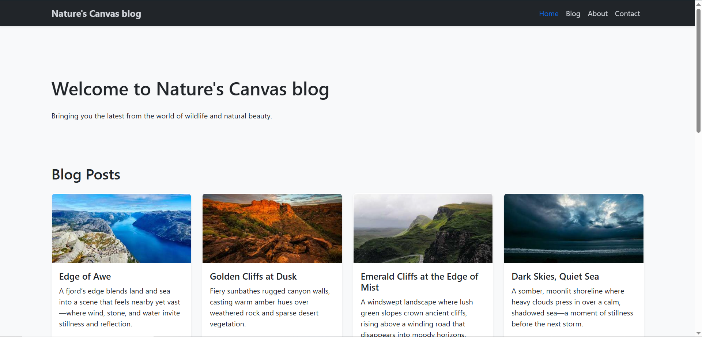
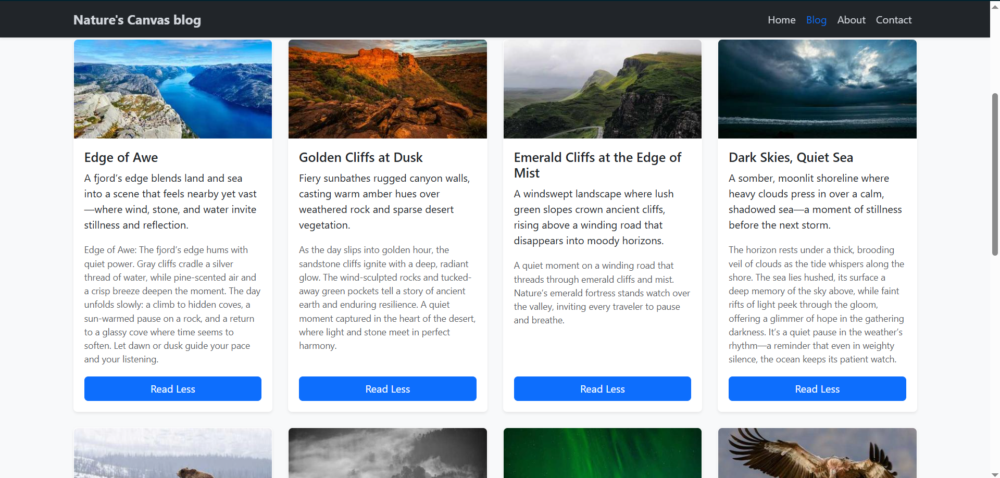

# 🌿 Nature's Canvas Blog

## 🎯 Objective

A simple and responsive blog website built using Bootstrap 5, showcasing nature-themed posts with images, descriptions, and expandable content.

---

## 🛠️ Tools And Technologies Used
- VS Code
- Chrome Browser
- HTML5
- CSS3
- Bootstrap 5 (CDN)
- Bootstrap Icons
- JavaScript (for dynamic card generation & Read More/Read Less toggle)

---

📁 Project Structure
```
responsive-blog-template/
│── assets/
|   │──blog-section.png
|   └──home-section.png
└── index.html
```

----

## 📝 Features

- Fully responsive blog layout using Bootstrap 5
- Dynamic blog post cards injected using JavaScript
- “Read More / Read Less” toggle for extended content
- Smooth card hover effects (blue glow + border highlight)
- Dark navbar & footer theme for elegant contrast
- Section navigation: Home, Blog, About, Contact
- Clean and modern UI with smooth transitions

---

## 📷 Screenshots

| Home Section                                                | Blog Section                                                |
| ----------------------------------------------------------- | ----------------------------------------------------------- |
|  |  |

---

## 🚀 How to Run

- Download or clone the project folder.
- Open the folder in VS Code or any editor.
- Simply open index.html in your browser.
- Scroll through the blog, expand posts with Read More, and enjoy!

----

## 💡 Bonus Functionality

- Smooth smooth-scrolling navigation
- Hover-enhanced cards for better UX
- Responsive grid layout for all devices
